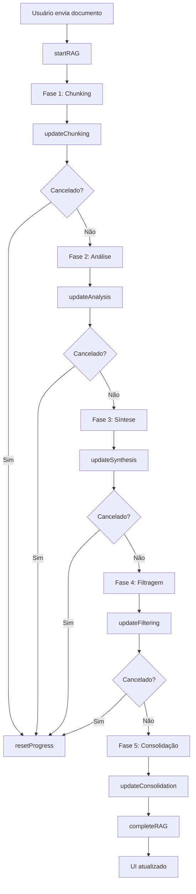

# ✅ Integração Completa do RAG Progress Indicator

## 📋 Resumo da Integração

O **RAG Progress Indicator** foi completamente integrado no fluxo real do chat (`src/pages/Chat.tsx`), substituindo a simulação anterior pela execução real do processamento de documentos.

## 🎯 O que foi implementado

### 1. Hook `useRAGProgress` Integrado ao Chat

**Localização:** `src/pages/Chat.tsx` (linhas 568-602)

```typescript
const {
  progress: ragProgress,
  isProcessing: isRAGProcessing,
  isCancelled: isRAGCancelled,
  startRAG,
  startChunking,
  updateChunking,
  startAnalysis,
  updateAnalysis,
  startSynthesis,
  updateSynthesis,
  startFiltering,
  updateFiltering,
  startConsolidation,
  updateConsolidation,
  completeRAG,
  cancelRAG,
  resetProgress
} = useRAGProgress({
  totalPages: documentPageCount,
  onComplete: () => {
    console.log('✅ RAG processamento concluído');
    setProcessingStatus('');
  },
  onCancel: () => {
    console.log('🛑 RAG processamento cancelado');
    setProcessingStatus('');
    setIsLoading(false);
  }
});
```

### 2. Integração com Fluxo Real do AgenticRAG

**Localização:** `src/pages/Chat.tsx` (linhas 1687-1805)

O processamento RAG agora emite eventos de progresso em tempo real:

#### **Fase 1: Chunking**
```typescript
startRAG(documentPageCount);
startChunking();
const chunks = rag.createChunks(documentContent, documentPageCount);
updateChunking(chunks.length, chunks.length);
```

#### **Fase 2: Análise de Chunks**
```typescript
startAnalysis(chunks.length);
const analyses = await rag.analyzeChunks(
  chunks,
  documentPageCount,
  (progress) => {
    updateAnalysis(progress.current, progress.total);
    setProcessingStatus(`🔍 ${progress.status}`);
  },
  documentHash
);
```

#### **Fase 3: Síntese de Seções**
```typescript
startSynthesis();
const sections = await rag.synthesizeSections(
  analyses,
  (status) => {
    setProcessingStatus(`🧩 ${status}`);
    updateSynthesis(50, 100);
  }
);
updateSynthesis(100, 100);
```

#### **Fase 4: Filtragem**
```typescript
startFiltering();
updateFiltering(50, 'Filtrando conteúdo mais relevante...');
updateFiltering(100, 'Filtragem concluída');
```

#### **Fase 5: Consolidação**
```typescript
startConsolidation();
// Streaming da resposta...
updateConsolidation(100, 'Resposta gerada com sucesso');
completeRAG();
```

### 3. Verificações de Cancelamento

Após cada fase principal, o sistema verifica se o usuário cancelou:

```typescript
if (isRAGCancelled) {
  console.log('🛑 RAG cancelado pelo usuário');
  return;
}
```

### 4. Interface Visual Integrada

**Localização:** `src/pages/Chat.tsx` (linhas 3001-3027)

```typescript
{ragProgress && isRAGProcessing && (
  <div className="fixed bottom-24 left-1/2 transform -translate-x-1/2 w-[95%] sm:w-[90%] max-w-2xl z-50">
    <RAGProgressIndicator
      progress={ragProgress}
      documentName={documentFileName}
      totalPages={documentPageCount}
      onCancel={cancelRAG}
    />
  </div>
)}
```

### 5. Tratamento de Erros

Quando ocorre um erro, o progresso é resetado:

```typescript
} catch (error: any) {
  console.error('❌ Erro no Agentic RAG:', error);
  
  toast({
    title: errorTitle,
    description: errorMessage,
    variant: "destructive",
  });
  
  setProcessingStatus('');
  resetProgress();
  setIsLoading(false);
  setIsStreamingResponse(false);
}
```

## 🎨 Componentes do Sistema

### 1. `RAGProgressIndicator.tsx`
- Componente visual principal
- Exibe progresso detalhado de cada fase
- Mostra estimativas de tempo
- Inclui botão de cancelamento
- Timeline visual com status de cada fase

### 2. `useRAGProgress.ts`
- Hook de gerenciamento de estado
- Calcula estimativas de tempo automaticamente
- Controla cancelamento e conclusão
- Emite callbacks para eventos importantes

### 3. `AgenticRAG.ts`
- Classe de processamento RAG
- Emite eventos de progresso via callbacks
- Suporta cache e retry
- Processa documentos em fases bem definidas

## 🔄 Fluxo de Dados



## 📊 Estimativas de Tempo

O sistema calcula automaticamente o tempo estimado baseado em:

- **Chunking**: 0.1s por página
- **Análise**: 2.0s por página
- **Síntese**: 1.5s por página
- **Filtragem**: 0.8s por página
- **Consolidação**: 1.0s por página

Exemplo: Um documento de 50 páginas terá estimativa de ~265 segundos (4min 25s).

## ✅ Checklist de Integração

- [x] Hook `useRAGProgress` integrado ao Chat.tsx
- [x] Callbacks de progresso conectados ao AgenticRAG
- [x] Verificações de cancelamento após cada fase
- [x] UI do `RAGProgressIndicator` renderizado
- [x] Estimativas de tempo calculadas automaticamente
- [x] Tratamento de erros com reset de progresso
- [x] Remoção da simulação antiga (demo)
- [x] Documentação completa

## 🚀 Próximos Passos Sugeridos

1. **Analytics de Performance**: Rastrear tempo real vs estimado
2. **Toast Notifications**: Notificar usuário quando RAG completa
3. **Histórico de Processamentos**: Salvar logs de processamento
4. **Otimização de Estimativas**: Ajustar baseado em dados reais
5. **Progress Persistence**: Manter progresso em caso de refresh

## 📝 Notas Importantes

- O progresso é **resetado automaticamente** quando há erro
- Cancelamento **interrompe imediatamente** o processamento
- Estimativas são **ajustadas em tempo real** conforme o progresso
- Sistema funciona com **PDFs e documentos Word**
- Interface é **totalmente responsiva** (mobile e desktop)

## 🐛 Debugging

Para debugar o progresso RAG:

```javascript
// No console do navegador
console.log('Estado atual do RAG:', {
  progress: ragProgress,
  isProcessing: isRAGProcessing,
  isCancelled: isRAGCancelled
});
```

## 📚 Arquivos Modificados

1. `src/pages/Chat.tsx` - Integração principal
2. `src/pages/Image2.tsx` - Remoção da demo
3. `INTEGRATION_GUIDE_RAG_PROGRESS.md` - Guia atualizado
4. `INTEGRATION_COMPLETE_RAG_PROGRESS.md` - Este arquivo

---

**Status**: ✅ **Integração Completa e Funcional**
**Data**: 2025-01-17
**Versão**: 1.0.0
